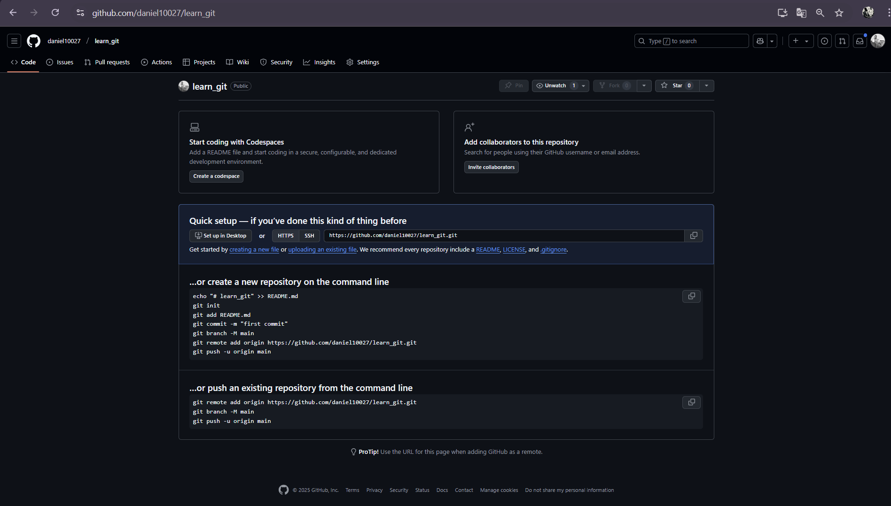

```markdown
# Welcome to the Learn Git Repository! 🚀

This repository serves as a step-by-step guide for learning Git. Below, you'll find instructions on how I initialized a Git repository and tracked
changes using a variety of Git commands. Each step is accompanied by a screenshot that shows the execution of each command. 📸
```

## Table of Contents 📚

00. [Github New Repository Page] 
0. [Github Page For Defined Repository Informations]
1. 

---
## Conclusion 🎉

By following the steps in this repository, you have learned how to initialize a Git repository, add and remove files, configure Git, and push your changes to a remote repository. Keep practicing, and soon you'll be a Git master! 👨‍💻👩‍💻

Happy coding! 😊
```

