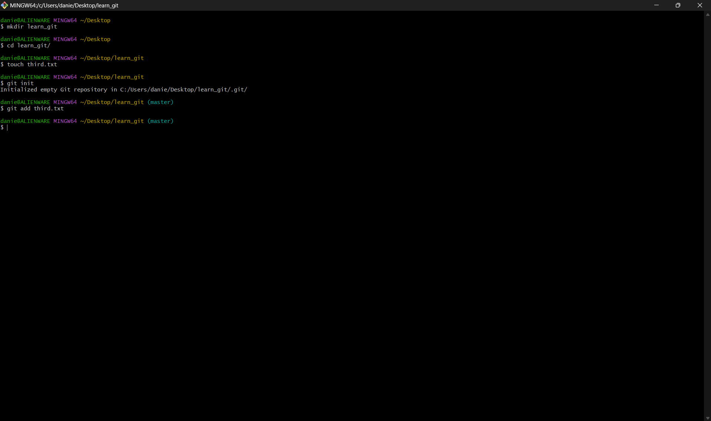

# Learn Git - Step-by-Step Guide 🚀

This repository showcases a detailed, step-by-step process of learning Git with screenshots at each stage. Below, you'll find 20 steps showing how to set up, commit, configure, and push to GitHub with proper explanations.

---

## 00. [GitHub New Repository Page] 📄

This is where you start by creating a new repository on GitHub. Fill out the repository name, description, and other settings.

---

## 1. [GitHub Page For Defined Repository Informations] 🔍

This step shows the GitHub page after your repository has been defined. You'll see basic information about your repository, like its name and description.

---

## 2. [Clone Your Repository Locally] 💻

Clone your newly created GitHub repository to your local machine using the `git clone` command. This allows you to work on your files locally.

---

## 3. [Navigate to the Local Repository] 🧭

After cloning, navigate into the project folder. This step shows how to move into your project directory using `cd <repo_name>`.

---

## 4. [Create a New File - `third.txt`] ✍️

Here, we create a new file called `third.txt` in the local repository using the `touch` command.

---

## 5. [Add `third.txt` to Staging Area] 📥

The `git add` command stages the file `third.txt` to be tracked by Git. This prepares it for commit.

---

## 6. [Commit Changes with Message] 💬

Commit your staged changes with a custom message, like `"adding third.txt"`, to keep track of changes in your repository.

---

## 7. [Check Git Log] 📜

Use `git log` to view the commit history of your repository. This shows the changes made, along with commit messages.

---

## 8. [Create a New File - `fourth.txt`] ✍️

Create another file named `fourth.txt` in your local repository.

---

## 9. [Add `fourth.txt` to Staging Area] 📥

Stage the `fourth.txt` file for commit by adding it to Git’s staging area with the `git add` command.

---

## 10. [Commit `fourth.txt` with a Custom Message] 💬

Commit the new file `fourth.txt` with the message `"adding fourth.txt"` to track changes.

---

## 11. [Remove a File - `third.txt`] 🗑️

In this step, we remove the previously added file `third.txt` using the `git rm` command.

---

## 12. [Add Removal of `third.txt` to Staging Area] 📥

After removing the file, stage this change using `git add .` to include the removal in the next commit.

---

## 13. [Commit File Removal with Message] 📝

Commit the removal of `third.txt` with a message like `"removing third.txt"` to log the deletion.

---

## 14. [Change Git Configuration - `core.pager=cat`] ⚙️

Here, we modify the global Git configuration to set `core.pager=cat`, which allows you to view logs without pagination.

---

## 15. [Check Current Git Configuration] 🔧

Use the `git config --global --list` command to check the global configuration settings applied to your Git installation.

---

## 16. [Add Remote Repository] 🌍

Add a remote repository (like GitHub) with the `git remote add origin` command to link your local repository to a remote one.

---

## 17. [Push Changes to Remote Repository] 🚀

Push your local commits to the remote repository on GitHub using `git push -u origin main`.

---

## 18. [Create a New Branch - `feature_branch`] 🌿

Create a new branch to work on a feature using the `git branch <branch_name>` command.

---

## 19. [Switch to the New Branch] 🔄

Switch to your new branch using the `git checkout <branch_name>` command to start working on the feature.

---

## 20. [Merge Branch into Main] 🔀

Finally, merge your new branch into the main branch using `git merge <branch_name>` to incorporate changes into the main branch.

---

## Conclusion 🎉

By following these 20 steps, you've learned how to initialize a repository, commit files, remove files, push changes to GitHub, and use basic Git commands like `git log`, `git add`, and `git commit`. Keep practicing, and soon you'll be a Git pro! 👨‍💻👩‍💻

Happy coding! 😊
